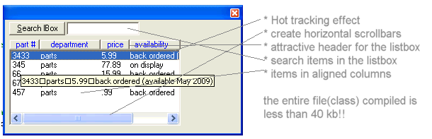



## Listbox class  ==\> hot\-tracking effect =\> horizontal scrollbars =\> add header =\> seperate tooltip fo

### Description

This is a listbox class that adds several great features to the standard listbox. (1) function draw_header:=This function draws an attractive header at the top of your listbox so it looks more like a listview control. The string you provide should be the text you want for your header, seperated by pipe ""|"" characters. The [container] parameter is the object the listbox is drawn on..ie the form or frame or picturebox  (2) sub additems_with_tabs:="This sub allows you to additems to the listbox in such a manner that string ""string|string2|string3"" takes the pipe character and converts it to tabs" (3) sub horiz_scrollbars:="Allows you to add horizontal scrollbars to the listbox. If [scroll_width] is not supplied then the items in the list are scanned and if horizontal scrollbars are required, then it is added, making the listbox wide enouph to view the widest list entry. If [scroll_width] is supplied then you are manually adding them, the width based upon the value you supply for  [scroll_width]." (4) function search:="Allows you to search for an item in the listbox. This acts like the autocomplete feature of browsers in that the search is case insensitive, and a partial match returns the index of the first listitem matching so a search of ""VIS"", for example, will return the index of ""visual basic"" entry in the listbox." (5)initialize_listbox:= "This must be the first method called and it sets reference to the listbox you will be referring to in this class." (6) sub hot_tracking (this one is real cool) "Calling this sub and setting [benable] to True makes your listbox have a ""hot-tracking"" effect in that moving your mouse over the listbox causes the item under your mouse to be hilighted"  (7) sub individual_item_tooltips:="The tooltip for the listbox displays the contents of the listitem the mouse is over. Useful if the contents of listitems width exceed the width of the listbox itself" (8) sub tabstops:="Set tabstop points for the listbox. Specify in pixels..a value for each succeeding column" (9) sub add_many_items:="Enables you to add multiple items with one call. Each item to add is seperated by a comma."
 
### More Info
 

             |
---                |---
**Submitted On**   |2005-02-03 05:28:56
**By**             |[Evan Toder](https://github.com/Planet-Source-Code/PSCIndex/blob/master/ByAuthor/evan-toder.md)
**Level**          |Intermediate
**User Rating**    |4.7 (56 globes from 12 users)
**Compatibility**  |VB 3\.0, VB 4\.0 \(16\-bit\), VB 4\.0 \(32\-bit\), VB 5\.0, VB 6\.0
**Category**       |[Custom Controls/ Forms/  Menus](https://github.com/Planet-Source-Code/PSCIndex/blob/master/ByCategory/custom-controls-forms-menus__1-4.md)
**World**          |[Visual Basic](https://github.com/Planet-Source-Code/PSCIndex/blob/master/ByWorld/visual-basic.md)
**Archive File**   |[Listbox\_cl184763232005\.zip](https://github.com/Planet-Source-Code/evan-toder-listbox-class-hot-tracking-effect-horizontal-scrollbars-add-header-seperate-too__1-58629/archive/master.zip)

